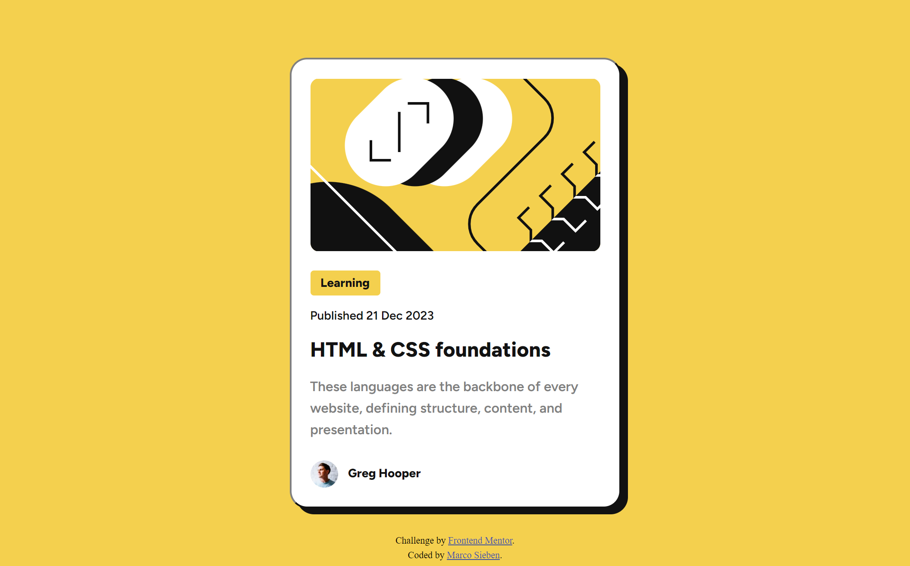

# Blog preview card solution | Frontend Mentor

This is a solution to the [Blog preview card challenge on Frontend Mentor](https://www.frontendmentor.io/challenges/blog-preview-card-ckPaj01IcS).

## Table of contents

- [Overview](#overview)
  - [The challenge](#the-challenge)
  - [Screenshot](#screenshot)
  - [Links](#links)
- [My process](#my-process)
  - [Built with](#built-with)
  - [Continued development](#continued-development)
  - [Useful resources](#useful-resources)
- [Author](#author)

## Overview

### The challenge

Users should be able to:

- See hover and focus states for all interactive elements on the page

### Screenshot

### Links

- Solution URL: https://github.com/sieben-marco/blog-preview-card-main
- Live Site URL: https://sieben-marco.github.io/blog-preview-card-main

## My process

### Built with

- Semantic HTML5 markup
- CSS custom properties
- Flexbox
- Media Queries
- Mobile-first workflow
- Pseudo-class
- [BEM](https://en.bem.info/methodology/quick-start/) - Block, Element, Modifier

### Continued development

I wanna continue to resolve challanges from Frontend Mentor and learn more about some js and js frameworks.

### Useful resources

- [MDN :last-child](https://developer.mozilla.org/en-US/docs/Web/CSS/:last-child) - Article about pseudo class last-child.
- [MDN :first-child](https://developer.mozilla.org/en-US/docs/Web/CSS/:first-child) - Article about pseudo class first-child.
- [MDN :nth-child](https://developer.mozilla.org/pt-BR/docs/Web/CSS/:nth-child) - Article about pseudo class nth-child.
- [MDN cursor](https://developer.mozilla.org/en-US/docs/Web/CSS/cursor) - Article about cursor (url(custom-cursor-example.png)).

## Author

<!-- - Website - [Add your name here](https://www.your-site.com) -->
- Frontend Mentor - [@sieben-marco](https://www.frontendmentor.io/profile/sieben-marco)
- LinkedIn - [Marco Sieben](https://www.linkedin.com/in/sieben-marco)
